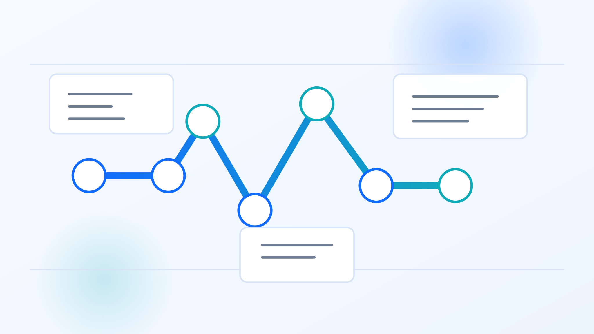

# ITOps Toolkit

[](https://github.com/NPFernando/ITOps-Toolkit/actions/workflows/qa.yml)


Free public tools for IT admins, automation engineers, MSP engineers, and DevOps users.

ITOps Toolkit is a public-safe Streamlit dashboard for common troubleshooting tasks. It does not require login, does not use a database, and does not permanently store user-entered domains, logs, JSON, JWTs, or encoded text.

## Documentation Visual



Use this lightweight poster in docs headers and release summaries to reinforce diagnostics-to-reporting flow without adding dense UI screenshots. Generated visual assets live in `docs/assets/` (inventory: `docs/assets/INDEX.md`).

## Features

- Domain Health Checker with DNS, SSL, HTTP, DNSSEC, SPF/DMARC posture, MTA-STS, TLS-RPT, recommendations, CSV, Markdown, and standalone HTML exports.
- DNS Record Checker for A, AAAA, MX, TXT, NS, CNAME, SOA, SPF, and DMARC records.
- SSL Certificate Checker with subject, issuer, SANs, validity dates, and expiration status.
- HTTP Status Checker with redirects, response time, selected headers, and security recommendations.
- JSON Formatter with validation, formatting, minifying, and download support.
- Base64 encoder and decoder.
- JWT Decoder that reads header and payload without verifying or sending the token externally.
- Cron Explainer for common 5-field cron expressions.
- Log Troubleshooting Assistant with rule-based, public-safe analysis and optional Azure AI summaries.
- Roadmap & Feedback board with curated seed items, live public GitHub Issues, planned work, completed work, and static AI recommendations.
- Health Diagnostics page with public-safe runtime checks for app basics, optional integrations, feature flags, and safe smoke probes.
- Home "Start Here Workflows" guidance for common triage journeys (domain incident, endpoint debugging, token/auth troubleshooting).

## Local Setup

Use Python 3.11 or newer.

### Makefile workflow

```bash
make setup
make run
```

Then open the local Streamlit URL shown in the terminal. By default, `make run` starts Streamlit on port `8502`. Override it when needed:

```bash
make run PORT=8503
```

Useful local commands:

```bash
make help       # list available commands
make release-gates # fast pre-merge reliability/release checks
make qa         # compile Python files and run tests
make test       # run pytest only
make clean      # remove local Python caches
```

### Manual workflow

```bash
python3 -m venv .venv
. .venv/bin/activate
pip install -r requirements.txt
```

For local development and tests, install the dev requirements after activating the virtual environment:

```bash
pip install -r requirements-dev.txt
```

## How to Run

With the Makefile:

```bash
make run
```

Or manually after activating the virtual environment:

```bash
streamlit run app.py
```

Then open the local Streamlit URL shown in the terminal.

Local Streamlit file watching is disabled in `.streamlit/config.toml` for stability on WSL-mounted Windows drives. Restart the Streamlit command after editing files.

### Dev baseline instrumentation (optional)

For lightweight local timing baselines on key surfaces (Home, Roadmap & Feedback, Domain Health Checker, DNS Record Checker, SSL Certificate Checker, HTTP Status Checker), run:

```bash
ITOPS_DEV_BASELINE=1 streamlit run app.py
```

Then open those pages and check **Sidebar → "Dev baseline metrics"**:

- `render` metric = total page script render time for that rerun
- `Checkpoints` = coarse milestones (`shell-ready`, `content-rendered`)
- `Recent samples` = latest session-only timings for quick comparisons

This is dev-only (off by default) and captures only surface labels + timings. It does not persist or export user-entered domains, URLs, logs, JWTs, JSON, or other inputs.

## Local Secrets

The app does not require secrets for normal rule-based operation. Optional Azure AI summaries for the Log Troubleshooting Assistant require a local-only Streamlit secrets file:

```bash
cp .streamlit/secrets.example.toml .streamlit/secrets.toml
```

Then set values in `.streamlit/secrets.toml`. That file is ignored by git and must not be committed.

The example includes placeholders for direct OpenAI and Azure AI Foundry/Azure OpenAI configuration:

- `OPENAI_API_KEY`
- `AZURE_OPENAI_API_KEY`
- `AZURE_OPENAI_ENDPOINT`
- `AZURE_OPENAI_DEPLOYMENT`
- `AZURE_OPENAI_API_VERSION`

Only Azure AI Foundry/Azure OpenAI is wired today. Direct `OPENAI_API_KEY` support is reserved and does not enable AI summaries. Azure AI summaries are opt-in per Log Troubleshooting submission and send only sanitized log text to the configured Azure OpenAI deployment.

Optional public links:

- `ITOPS_GITHUB_URL` overrides the default repository URL used by the GitHub button, Roadmap & Feedback issue links, and read-only public GitHub Issues feed. It is not a secret.

For setup and manual validation steps, see [docs/azure-ai-setup.md](docs/azure-ai-setup.md).

## Tests

With the Makefile:

```bash
make qa
```

Or manually:

```bash
python -m compileall app.py pages utils
python -m pytest
```

The pytest suite uses fakes for DNS, HTTP, TLS, GitHub Issues, and Azure/OpenAI adapter tests. It does not require external network access, browser automation, secrets, or OpenAI credentials.

## Deployment Notes

This app is ready for Streamlit Community Cloud:

1. Push the project to a public or private GitHub repository.
2. Create a new Streamlit Community Cloud app.
3. Set the main file path to `app.py`.
4. Optionally set `ITOPS_GITHUB_URL` if deploying a fork and directing feedback to a different repository.
5. Do not add secrets unless optional Azure AI summaries are needed. See [docs/azure-ai-setup.md](docs/azure-ai-setup.md) for the required keys and smoke checks.

No database or background worker is required. Roadmap feedback reads public GitHub Issues anonymously. Azure OpenAI is optional and used only when configured and explicitly enabled on a log-analysis submission.

## Release Readiness

Before deployment, use [docs/release-checklist.md](docs/release-checklist.md). For release summaries, use [docs/release-notes-template.md](docs/release-notes-template.md), including the concise UX Quality Outcomes section for public-safe release reporting.
For Phase 8 cross-page consistency standards and documented exceptions, use [docs/ui-consistency-audit-matrix-phase8.md](docs/ui-consistency-audit-matrix-phase8.md).
For Phase 9 wave-2 shell/mobile/visual/a11y QA gates, follow the Wave 2 sections in [docs/design-system.md](docs/design-system.md) and [docs/release-checklist.md](docs/release-checklist.md).
For Phase 10 wave-3 shell/mobile/visual/a11y QA gates, follow the Wave 3 sections in [docs/design-system.md](docs/design-system.md), [docs/release-checklist.md](docs/release-checklist.md), and [docs/release-notes-template.md](docs/release-notes-template.md).
For Phase 11 wave-4 shell/mobile/visual/a11y QA gates, follow the Wave 4 sections in [docs/design-system.md](docs/design-system.md), [docs/release-checklist.md](docs/release-checklist.md), [docs/release-notes-template.md](docs/release-notes-template.md), and [docs/assets/INDEX.md](docs/assets/INDEX.md).
For Phase 12 wave-5 shell/mobile/visual/a11y QA gates, follow the Wave 5 sections in [docs/design-system.md](docs/design-system.md), [docs/release-checklist.md](docs/release-checklist.md), [docs/release-notes-template.md](docs/release-notes-template.md), and [docs/assets/INDEX.md](docs/assets/INDEX.md).
For Phase 13 wave-6 shell/mobile/visual/a11y QA gates, follow the Wave 6 sections in [docs/design-system.md](docs/design-system.md), [docs/release-checklist.md](docs/release-checklist.md), [docs/release-notes-template.md](docs/release-notes-template.md), and [docs/assets/INDEX.md](docs/assets/INDEX.md).
For Phase 14 wave-7 shell/mobile/visual/a11y QA gates, follow the Wave 7 sections in [docs/design-system.md](docs/design-system.md), [docs/release-checklist.md](docs/release-checklist.md), [docs/release-notes-template.md](docs/release-notes-template.md), and [docs/assets/INDEX.md](docs/assets/INDEX.md).
For Phase 15 wave-8 shell/mobile/visual/a11y QA gates, follow the Wave 8 sections in [docs/design-system.md](docs/design-system.md), [docs/release-checklist.md](docs/release-checklist.md), [docs/release-notes-template.md](docs/release-notes-template.md), and [docs/assets/INDEX.md](docs/assets/INDEX.md).
For Phase 16 wave-9 shell/mobile/visual/a11y QA gates, follow the Wave 9 sections in [docs/design-system.md](docs/design-system.md), [docs/release-checklist.md](docs/release-checklist.md), [docs/release-notes-template.md](docs/release-notes-template.md), and [docs/assets/INDEX.md](docs/assets/INDEX.md).
For Phase 17 wave-10 shell/mobile/visual/a11y QA gates, follow the Wave 10 sections in [docs/design-system.md](docs/design-system.md), [docs/release-checklist.md](docs/release-checklist.md), [docs/release-notes-template.md](docs/release-notes-template.md), and [docs/assets/INDEX.md](docs/assets/INDEX.md).
For Phase 18 wave-11 shell/mobile/visual/a11y QA gates, follow the Wave 11 sections in [docs/design-system.md](docs/design-system.md), [docs/release-checklist.md](docs/release-checklist.md), [docs/release-notes-template.md](docs/release-notes-template.md), and [docs/assets/INDEX.md](docs/assets/INDEX.md).
For Phase 19 wave-12 shell/mobile/visual/a11y QA gates, follow the Wave 12 sections in [docs/design-system.md](docs/design-system.md), [docs/release-checklist.md](docs/release-checklist.md), [docs/release-notes-template.md](docs/release-notes-template.md), and [docs/assets/INDEX.md](docs/assets/INDEX.md).
For Phase 20 wave-13 shell/mobile/visual/a11y QA gates, follow the Wave 13 sections in [docs/design-system.md](docs/design-system.md), [docs/release-checklist.md](docs/release-checklist.md), [docs/release-notes-template.md](docs/release-notes-template.md), and [docs/assets/INDEX.md](docs/assets/INDEX.md).
For Phase 21 wave-14 shell/mobile/visual/a11y QA gates, follow the Wave 14 sections in [docs/design-system.md](docs/design-system.md), [docs/release-checklist.md](docs/release-checklist.md), [docs/release-notes-template.md](docs/release-notes-template.md), and [docs/assets/INDEX.md](docs/assets/INDEX.md).
For Phase 22 wave-15 shell/mobile/visual/a11y QA gates, follow the Wave 15 sections in [docs/design-system.md](docs/design-system.md), [docs/release-checklist.md](docs/release-checklist.md), [docs/release-notes-template.md](docs/release-notes-template.md), and [docs/assets/INDEX.md](docs/assets/INDEX.md).
For Phase 23 wave-16 shell/mobile/visual/a11y QA gates, follow the Wave 16 sections in [docs/design-system.md](docs/design-system.md), [docs/release-checklist.md](docs/release-checklist.md), [docs/release-notes-template.md](docs/release-notes-template.md), and [docs/assets/INDEX.md](docs/assets/INDEX.md).
For Phase 24 wave-17 shell/mobile/visual/a11y QA gates, follow the Wave 17 sections in [docs/design-system.md](docs/design-system.md), [docs/release-checklist.md](docs/release-checklist.md), [docs/release-notes-template.md](docs/release-notes-template.md), and [docs/assets/INDEX.md](docs/assets/INDEX.md).
For Phase 25 wave-18 shell/mobile/visual/a11y QA gates, follow the Wave 18 sections in [docs/design-system.md](docs/design-system.md), [docs/release-checklist.md](docs/release-checklist.md), [docs/release-notes-template.md](docs/release-notes-template.md), and [docs/assets/INDEX.md](docs/assets/INDEX.md).
For Phase 26 wave-19 shell/mobile/visual/a11y QA gates, follow the Wave 19 sections in [docs/design-system.md](docs/design-system.md), [docs/release-checklist.md](docs/release-checklist.md), [docs/release-notes-template.md](docs/release-notes-template.md), and [docs/assets/INDEX.md](docs/assets/INDEX.md).
For Phase 27 wave-20 shell/mobile/visual/a11y QA gates, follow the Wave 20 sections in [docs/design-system.md](docs/design-system.md), [docs/release-checklist.md](docs/release-checklist.md), [docs/release-notes-template.md](docs/release-notes-template.md), and [docs/assets/INDEX.md](docs/assets/INDEX.md).
For Phase 28 wave-21 shell/mobile/visual/a11y QA gates, follow the Wave 21 sections in [docs/design-system.md](docs/design-system.md), [docs/release-checklist.md](docs/release-checklist.md), [docs/release-notes-template.md](docs/release-notes-template.md), and [docs/assets/INDEX.md](docs/assets/INDEX.md).
For Phase 29 wave-22 shell/mobile/visual/a11y QA gates, follow the Wave 22 sections in [docs/design-system.md](docs/design-system.md), [docs/release-checklist.md](docs/release-checklist.md), [docs/release-notes-template.md](docs/release-notes-template.md), and [docs/assets/INDEX.md](docs/assets/INDEX.md).
For Phase 30 wave-23 shell/mobile/visual/a11y QA gates, follow the Wave 23 sections in [docs/design-system.md](docs/design-system.md), [docs/release-checklist.md](docs/release-checklist.md), [docs/release-notes-template.md](docs/release-notes-template.md), and [docs/assets/INDEX.md](docs/assets/INDEX.md).
For Phase 31 wave-24 shell/mobile/visual/a11y QA gates, follow the Wave 24 sections in [docs/design-system.md](docs/design-system.md), [docs/release-checklist.md](docs/release-checklist.md), [docs/release-notes-template.md](docs/release-notes-template.md), and [docs/assets/INDEX.md](docs/assets/INDEX.md).
For Phase 32 wave-25 shell/mobile/visual/a11y QA gates, follow the Wave 25 sections in [docs/design-system.md](docs/design-system.md), [docs/release-checklist.md](docs/release-checklist.md), [docs/release-notes-template.md](docs/release-notes-template.md), and [docs/assets/INDEX.md](docs/assets/INDEX.md).
For Phase 33 wave-26 shell/mobile/visual/a11y QA gates, follow the Wave 26 sections in [docs/design-system.md](docs/design-system.md), [docs/release-checklist.md](docs/release-checklist.md), [docs/release-notes-template.md](docs/release-notes-template.md), and [docs/assets/INDEX.md](docs/assets/INDEX.md).
For Phase 34 wave-27 shell/mobile/visual/a11y QA gates, follow the Wave 27 sections in [docs/design-system.md](docs/design-system.md), [docs/release-checklist.md](docs/release-checklist.md), [docs/release-notes-template.md](docs/release-notes-template.md), and [docs/assets/INDEX.md](docs/assets/INDEX.md).
For Phase 35 wave-28 shell/mobile/visual/a11y QA gates, follow the Wave 28 sections in [docs/design-system.md](docs/design-system.md), [docs/release-checklist.md](docs/release-checklist.md), [docs/release-notes-template.md](docs/release-notes-template.md), and [docs/assets/INDEX.md](docs/assets/INDEX.md).
For Phase 36 wave-29 shell/mobile/visual/a11y QA gates, follow the Wave 29 sections in [docs/design-system.md](docs/design-system.md), [docs/release-checklist.md](docs/release-checklist.md), [docs/release-notes-template.md](docs/release-notes-template.md), and [docs/assets/INDEX.md](docs/assets/INDEX.md).
For Phase 37 wave-30 shell/mobile/visual/a11y QA gates, follow the Wave 30 sections in [docs/design-system.md](docs/design-system.md), [docs/release-checklist.md](docs/release-checklist.md), [docs/release-notes-template.md](docs/release-notes-template.md), and [docs/assets/INDEX.md](docs/assets/INDEX.md).
For Phase 38 wave-31 shell/mobile/visual/a11y QA gates, follow the Wave 31 sections in [docs/design-system.md](docs/design-system.md), [docs/release-checklist.md](docs/release-checklist.md), [docs/release-notes-template.md](docs/release-notes-template.md), and [docs/assets/INDEX.md](docs/assets/INDEX.md).
For Phase 39 wave-32 shell/mobile/visual/a11y QA gates, follow the Wave 32 sections in [docs/design-system.md](docs/design-system.md), [docs/release-checklist.md](docs/release-checklist.md), [docs/release-notes-template.md](docs/release-notes-template.md), and [docs/assets/INDEX.md](docs/assets/INDEX.md).
For Phase 40 wave-33 shell/mobile/visual/a11y QA gates, follow the Wave 33 sections in [docs/design-system.md](docs/design-system.md), [docs/release-checklist.md](docs/release-checklist.md), [docs/release-notes-template.md](docs/release-notes-template.md), and [docs/assets/INDEX.md](docs/assets/INDEX.md).
For Phase 41 wave-34 shell/mobile/visual/a11y QA gates, follow the Wave 34 sections in [docs/design-system.md](docs/design-system.md), [docs/release-checklist.md](docs/release-checklist.md), [docs/release-notes-template.md](docs/release-notes-template.md), and [docs/assets/INDEX.md](docs/assets/INDEX.md).
For Phase 42 wave-35 shell/mobile/visual/a11y QA gates, follow the Wave 35 sections in [docs/design-system.md](docs/design-system.md), [docs/release-checklist.md](docs/release-checklist.md), [docs/release-notes-template.md](docs/release-notes-template.md), and [docs/assets/INDEX.md](docs/assets/INDEX.md).
For Phase 43 wave-36 shell/mobile/visual/a11y QA gates, follow the Wave 36 sections in [docs/design-system.md](docs/design-system.md), [docs/release-checklist.md](docs/release-checklist.md), [docs/release-notes-template.md](docs/release-notes-template.md), and [docs/assets/INDEX.md](docs/assets/INDEX.md).
For runtime troubleshooting and diagnostics interpretation, use [docs/ops-runbook.md](docs/ops-runbook.md).
For adapter timeout/retry/error/cache/privacy reliability standards, see [docs/reliability-contract.md](docs/reliability-contract.md).

## UI Design Notes

The dashboard shell, tool metadata, navigation, and reusable visual components live in `utils/ui.py`. Future UI changes should follow `docs/design-system.md`.
For Phase 4 reliability/performance alignment notes, see `docs/streamlit-performance-audit.md`.

### Phase 4 contributor reliability playbook

- **Fragments (`st.fragment`)**: keep these in shell/home rerun hot paths (`app.py` + `utils/ui.py`) so favorite/reorder interactions can rerun locally.
- **Caching (`st.cache_data`)**: use shared controls from `utils/cache_policy.py` (TTL tiers, stable cache keys, runtime test scope, freshness messaging) for user-facing cached reads.
- **Session state (`st.session_state`)**: keep per-session UI/result state in page modules; do not persist user-entered domains, URLs, logs, JWTs, JSON, or encoded text.
- **Dev baseline instrumentation**: local/dev-only via `ITOPS_DEV_BASELINE=1`, currently wired for Home, Roadmap & Feedback, Domain Health Checker, DNS Record Checker, SSL Certificate Checker, and HTTP Status Checker.
- **Health diagnostics**: keep `pages/128_Health_Diagnostics.py` focused on non-sensitive runtime checks only; never display secrets or user payloads.

- Sidebar navigation is shell-managed (Home, Roadmap & Feedback, grouped tool links) with quick search.
- Home navigation supports **Quick access** and **All tools** modes, with favorites, recently used/popular, shared favorites, and new tool sections.
- The Phase 8 visual system uses generated SVG hooks in `utils/ui.py` (home hero, tool-card icons, category header illustrations, empty-state illustrations, roadmap badges) with graceful fallback rendering if an asset is unavailable.
- Generated assets and source/export structure are documented under `docs/assets/README.md` and `docs/assets/INDEX.md`.

## Roadmap Feedback

The Roadmap & Feedback page merges curated seed data from `data/roadmap_seed.json` with public GitHub Issues from the configured repository. User ideas are submitted through GitHub Issues; Streamlit does not store or write feedback.

Maintainer labels:

- `enhancement`: include the issue as a feature request.
- `status:in-progress` or `in progress`: show an open issue in the In Progress column.
- `status:complete` or `complete`: show an open issue in the Complete column. Closed issues also show as Complete.
- Optional category labels can match `Tools`, `Reports`, `Security`, `AI Ideas`, `UX / Design`, or `Integrations`; otherwise the issue form's Category field is used.

## Security Notes

- Do not paste passwords, private keys, production tokens, API keys, or sensitive customer data.
- User input is processed in memory only.
- Download exports are generated in memory only.
- The app does not intentionally log user input.
- `.streamlit/secrets.toml`, `.env`, and `.env.*` are ignored by git.
- JWTs are decoded locally without signature verification and are not sent externally.
- The log assistant uses rule-based analysis by default and sends sanitized logs to Azure OpenAI only when Azure settings are configured and the user opts in for that submission.
- Reliability failure handling standards (timeouts, retry classes, cache/stale rules, and public-safe error conventions) are defined in [docs/reliability-contract.md](docs/reliability-contract.md).

## Screenshots

Use [docs/screenshot-guide.md](docs/screenshot-guide.md) for release QA capture targets. Save temporary screenshots in a local untracked workspace folder such as `.artifacts/qa-screenshots/`.

## Future Roadmap

The in-app Roadmap & Feedback page is the source of truth for public planned items, completed items, live GitHub feature requests, and curated AI recommendations. Feedback submission opens GitHub Issues and does not store ideas in Streamlit.

- Add uptime and latency trend visualization for one-off checks without persistence.
