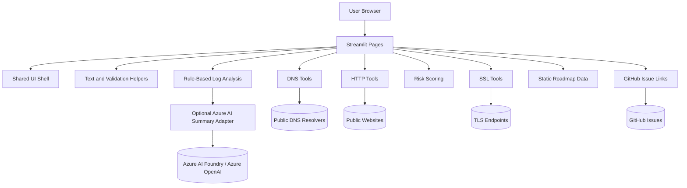

# Architecture

ITOps Toolkit is a public-safe Streamlit app with no login, no database, and no permanent user data storage.

## Boundaries

- Delivery/UI: `app.py` and `pages/`
- Shared UI system: `utils/ui.py` provides theme CSS, sidebar navigation, tool metadata, page headers, and home dashboard sections
- Application/core helpers: `utils/scoring.py`, `utils/text_tools.py`, and rule definitions in `utils/ai_tools.py`
- Roadmap data: `utils/roadmap.py` contains static public board categories, roadmap items, and search/filter helpers
- Project links: `utils/project_links.py` contains the default GitHub repository URL and optional `ITOPS_GITHUB_URL` override used by feedback links
- Adapters: `utils/dns_tools.py`, `utils/http_tools.py`, and `utils/ssl_tools.py`
- Optional AI adapter: `utils/ai_tools.py` can call Azure OpenAI for log summaries only when Azure settings are configured and the user opts in for a submission
- Persistence: none

## Public-Safe Data Handling

- User-entered values are processed in memory for the current Streamlit session.
- The app does not write user-entered domains, URLs, JWTs, logs, JSON, or encoded text to disk.
- The app does not print or log user-entered values.
- Download buttons generate CSV, Markdown, JSON, or text outputs in memory.
- The Log Troubleshooting Assistant sends sanitized logs to Azure OpenAI only when optional Azure settings are configured and the user checks the AI summary opt-in for that submission.
- Roadmap & Feedback submissions leave the app through a GitHub Issue URL. The Streamlit app does not store submitted ideas, votes, names, or issue content.
