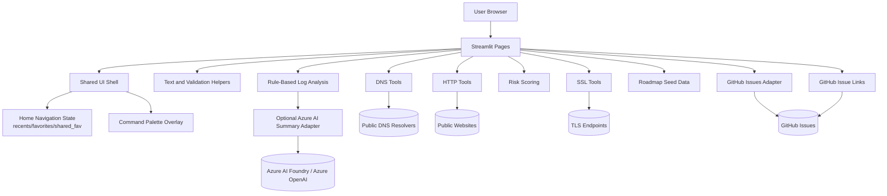

# Architecture

ITOps Toolkit is a public-safe Streamlit app with no login, no database, and no permanent user data storage.

```mermaid
flowchart TD
    U[User Browser] --> S[Streamlit Pages]
    S --> UI[Shared UI Shell]
    UI --> NAV[Home Navigation State<br/>recents/favorites/shared_fav]
    UI --> CP[Command Palette Overlay]
    S --> T[Text and Validation Helpers]
    S --> D[DNS Tools]
    S --> H[HTTP Tools]
    S --> C[SSL Tools]
    S --> R[Risk Scoring]
    S --> L[Rule-Based Log Analysis]
    S --> M[Roadmap Seed Data]
    S --> GI[GitHub Issues Adapter]
    L --> A[Optional Azure AI Summary Adapter]
    S --> G[GitHub Issue Links]
    D --> DNS[(Public DNS Resolvers)]
    H --> WEB[(Public Websites)]
    C --> TLS[(TLS Endpoints)]
    A --> AZ[(Azure AI Foundry / Azure OpenAI)]
    GI --> GH[(GitHub Issues)]
    G --> GH
```

## Boundaries

- Delivery/UI: `app.py` and `pages/`
- Shared UI system: `utils/ui.py` provides theme CSS, sidebar navigation, command palette, tool metadata, generated-asset hooks (`HOME_HERO_ILLUSTRATION`, `TOOL_CARD_ICON_ASSETS`, `TOOL_HEADER_ILLUSTRATION_BY_CATEGORY`, `EMPTY_STATE_ILLUSTRATIONS`, `ROADMAP_BADGE_ICONS`), page headers, and home dashboard sections
- UI navigation state boundary: recents/favorites/shared favorites are URL-query-param driven with browser localStorage mirroring (`utils/ui.py`); no server-side persistence
- Application/core helpers: `utils/scoring.py`, `utils/text_tools.py`, and rule definitions in `utils/ai_tools.py`
- Roadmap data: `utils/roadmap.py` loads curated seed items from `data/roadmap_seed.json`, normalizes public GitHub issues, and provides merge/search/filter helpers
- Project links: `utils/project_links.py` contains the default GitHub repository URL and optional `ITOPS_GITHUB_URL` override used by feedback links
- Adapters: `utils/dns_tools.py`, `utils/http_tools.py`, `utils/ssl_tools.py`, and read-only public GitHub issue fetching in `utils/github_issues.py`
- Optional AI adapter: `utils/ai_tools.py` can call Azure OpenAI for log summaries only when Azure settings are configured and the user opts in for a submission
- Persistence: none

## Runtime Visual Fallback Boundaries

- Generated visuals are non-blocking presentation assets loaded from `docs/assets/**/exported`.
- If an SVG is missing/invalid, `_svg_data_uri` resolves `None` and callers degrade safely:
  - home hero uses built-in CSS fallback markup;
  - tool cards fall back to text icon badges;
  - roadmap badges fall back to compact text glyphs;
  - page-header and empty-state illustration slots are omitted.
- These fallbacks do not affect tool execution, network checks, exports, or safety behavior.

## Public-Safe Data Handling

- User-entered values are processed in memory for the current Streamlit session.
- The app does not write user-entered domains, URLs, JWTs, logs, JSON, or encoded text to disk.
- The app does not print or log user-entered values.
- Domain Health email posture checks are DNS-only in v1 and do not fetch remote MTA-STS policy documents.
- Download buttons generate CSV, Markdown, HTML, JSON, or text outputs in memory.
- The Log Troubleshooting Assistant sends sanitized logs to Azure OpenAI only when optional Azure settings are configured and the user checks the AI summary opt-in for that submission.
- Roadmap & Feedback submissions leave the app through a GitHub Issue URL. The Streamlit app reads public issues but does not store submitted ideas, votes, names, or issue content.
