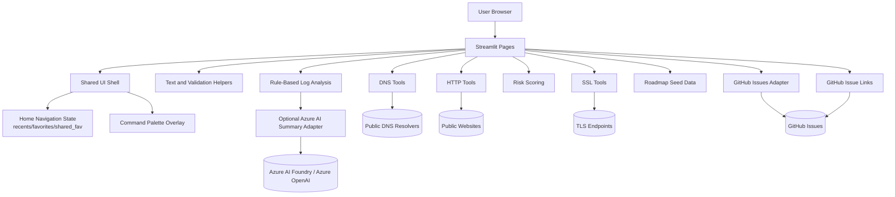

# Architecture

ITOps Toolkit is a public-safe Streamlit app with no login, no database, and no permanent user data storage.

For Streamlit-specific performance and framework-alignment decisions, see `docs/streamlit-performance-audit.md`.

```mermaid
flowchart TD
    U[User Browser] --> S[Streamlit Pages]
    S --> UI[Shared UI Shell]
    UI --> NAV[Home Navigation State<br/>recents/favorites/shared_fav]
    UI --> CP[Command Palette Overlay]
    S --> T[Text and Validation Helpers]
    S --> D[DNS Tools]
    S --> H[HTTP Tools]
    S --> C[SSL Tools]
    S --> R[Risk Scoring]
    S --> L[Rule-Based Log Analysis]
    S --> M[Roadmap Seed Data]
    S --> GI[GitHub Issues Adapter]
    L --> A[Optional Azure AI Summary Adapter]
    S --> G[GitHub Issue Links]
    D --> DNS[(Public DNS Resolvers)]
    H --> WEB[(Public Websites)]
    C --> TLS[(TLS Endpoints)]
    A --> AZ[(Azure AI Foundry / Azure OpenAI)]
    GI --> GH[(GitHub Issues)]
    G --> GH
```

## Boundaries

- Delivery/UI: `app.py` and `pages/`
- Shared UI system: `utils/ui.py` provides theme CSS, sidebar navigation, command palette, tool metadata, generated-asset hooks (`HOME_HERO_ILLUSTRATION`, `TOOL_CARD_ICON_ASSETS`, `TOOL_HEADER_ILLUSTRATION_BY_CATEGORY`, `EMPTY_STATE_ILLUSTRATIONS`, `ROADMAP_BADGE_ICONS`), page headers, and home dashboard sections
- Home render isolation: selected high-rerun card grids on `app.py` render through `utils/ui.py::render_fragment(...)`, so favorite/reorder clicks can rerun only the local fragment (`st.rerun(scope="fragment")`) where supported instead of rerunning the full shell
- Dev-only baseline instrumentation: `utils/dev_baseline.py` provides optional render timing for selected high-traffic surfaces, gated by `ITOPS_DEV_BASELINE`
- UI navigation state boundary: recents/favorites/shared favorites are URL-query-param driven with browser localStorage mirroring (`utils/ui.py`); write paths skip no-op query-param rewrites to avoid unnecessary reruns; no server-side persistence
- Home tool filtering/sorting is metadata-only and memoized (`utils/ui.py::filter_tools` uses a bounded cache) to avoid repeated recomputation during frequent shell-driven reruns
- Application/core helpers: `utils/scoring.py`, `utils/text_tools.py`, and rule definitions in `utils/ai_tools.py`
- Roadmap data: `utils/roadmap.py` loads curated seed items from `data/roadmap_seed.json`, normalizes public GitHub issues, and provides merge/search/filter helpers; `pages/10_Roadmap_Feedback.py` applies short-TTL `st.cache_data` (5 min board data, 1 hour AI triage summary) with stable runtime cache keys and per-test cache scoping
- Project links: `utils/project_links.py` contains the default GitHub repository URL and optional `ITOPS_GITHUB_URL` override used by feedback links
- Adapters: `utils/dns_tools.py`, `utils/http_tools.py`, `utils/ssl_tools.py`, and read-only public GitHub issue fetching in `utils/github_issues.py`
- Optional AI adapter: `utils/ai_tools.py` can call Azure OpenAI for log summaries only when Azure settings are configured and the user opts in for a submission
- Persistence: none

## Phase 3 Performance Playbook (placement)

- **Fragment patterns** (`st.fragment`) belong in shell/home interaction hot spots (`app.py`, `utils/ui.py`) where partial reruns reduce full-shell reruns.
- **Caching patterns** (`st.cache_data`) belong in read-only fetch/merge helpers with explicit short TTLs (current example: Roadmap loaders in `pages/10_Roadmap_Feedback.py`).
- **Session-state patterns** (`st.session_state`) belong in page-level UX/result boundaries; keep data session-local and never persist user-entered diagnostics content.
- **Baseline instrumentation** is dev-only and local (`ITOPS_DEV_BASELINE=1`), currently instrumenting Home, Roadmap & Feedback, Domain Health Checker, DNS Record Checker, SSL Certificate Checker, and HTTP Status Checker.

## Runtime Visual Fallback Boundaries

- Generated visuals are non-blocking presentation assets loaded from `docs/assets/**/exported`.
- If an SVG is missing/invalid, `_svg_data_uri` resolves `None` and callers degrade safely:
  - home hero uses built-in CSS fallback markup;
  - tool cards fall back to text icon badges;
  - roadmap badges fall back to compact text glyphs;
  - page-header and empty-state illustration slots are omitted.
- These fallbacks do not affect tool execution, network checks, exports, or safety behavior.

## Public-Safe Data Handling

- User-entered values are processed in memory for the current Streamlit session.
- The app does not write user-entered domains, URLs, JWTs, logs, JSON, or encoded text to disk.
- The app does not print or log user-entered values.
- Dev baseline metrics (when enabled locally) capture only static surface labels, checkpoint names, and elapsed timing values in Streamlit session state.
- Domain Health email posture checks are DNS-only in v1 and do not fetch remote MTA-STS policy documents.
- Download buttons generate CSV, Markdown, HTML, JSON, or text outputs in memory.
- The Log Troubleshooting Assistant sends sanitized logs to Azure OpenAI only when optional Azure settings are configured and the user checks the AI summary opt-in for that submission.
- Roadmap & Feedback submissions leave the app through a GitHub Issue URL. The Streamlit app reads public issues but does not store submitted ideas, votes, names, or issue content.
